# JUEGOS EN RED
## NOMBRE DEL JUEGO: 
Topwer
## DESCRIPCIÓN:
Juego de plataformas 2D para la asignatura de Juegos En Red
## MIEMBROS DEL GRUPO: 
Carlos Martín Hernández (c.martinh.2019@alumnos.urjc.es - carlosmartinhernandez79), Luis Mateos Sánchez (l.mateos.2020@alumnos.urjc.es - MrLuis33), Álvaro Redondo Molina (a.redondom.2021@alumnos.urjc.es - AlvaroRedondoURJC), Hugo Silva Gil (h.silva.2021@alumnos.urjc.es - HSilvaa).

# GGD

# TOPWER

  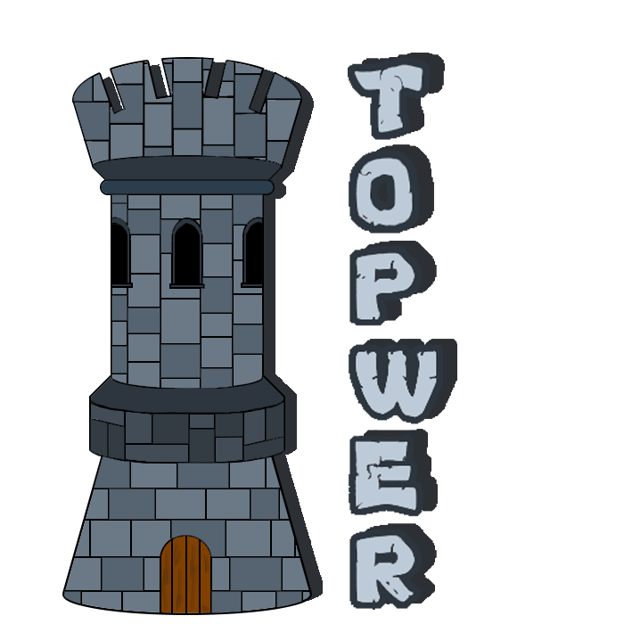

## Game Design Document
### Juegos En Red

### Hugo Silva Gil
### Álvaro Redondo Molina
### Carlos Martín Hernández
### Luis Mateos Sánchez

# EQUIPO Y CONCEPTO

## EQUIPO

Los integrantes de este proyecto son: Hugo Silva Gil (h.silva.2021@alumnos.urjc.es y usuario de GitHub HSilvaa), Carlos Martín Hernández (c.martinh.2019@alumnos.urjc.es ; usuario carlosmartinhernandez79), Luis Mateos Sánchez(l.mateos.2020@alumnos.urjc.es; usuario de GitHub  MrLuis33) y Álvaro Redondo Molina (a.redondom.2021@alumnos.urjc.es y usuario de GitHub AlvaroRedondoURJC).
Se dividirá el trabajo de la siguiente forma:

### Hugo: 
Se encargará de la parte de programación y del diseño de niveles. 

### Carlos:
Encargado de la historia principal,  animación de personajes y elementos y apoyo en programación.

### Álvaro:
Encargado del diseño de personajes, elementos y escenarios. Apoyo en animación y programación.

### Luis:
Encargado de la programación.

  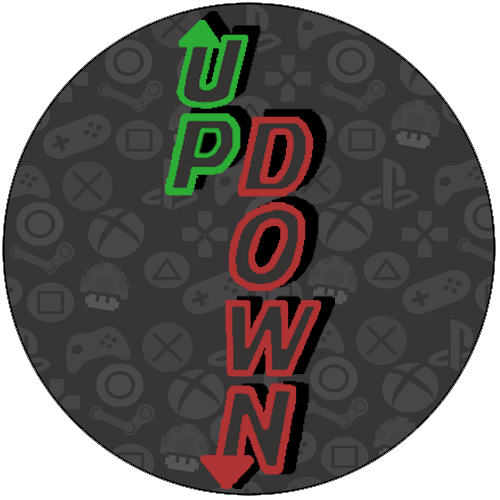
 
	LOGO EQUIPO
 

# CARACTERÍSTICAS DEL JUEGO

El juego es un plataformas 2D vertical con puzzles que los jugadores deben poder resolver de forma cooperativa. Es un juego para todos los públicos, aunque está centrado en un público juvenil.

El diseño será sencillo, colores pastel con una temática medieval. 

  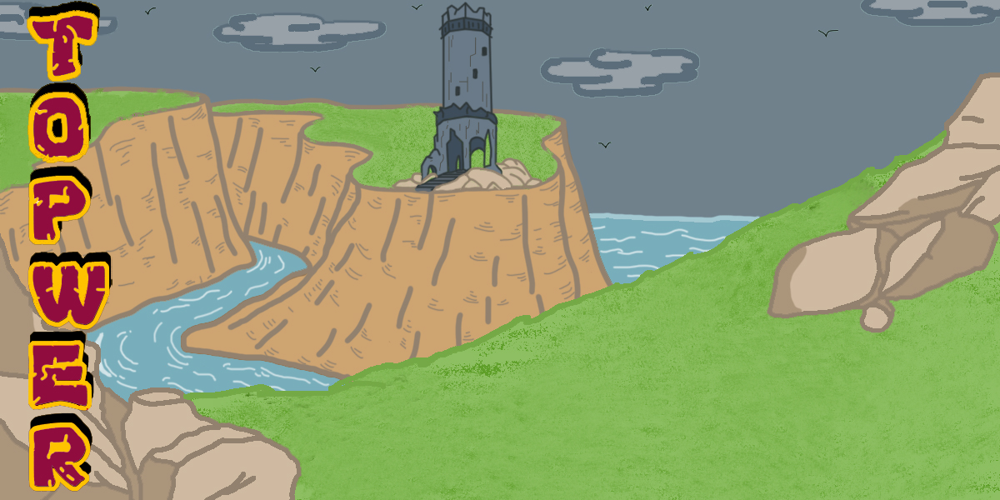
 
	PANTALLA PRINCIPAL
 

## HISTORIA

Todo era armonía y felicidad en Grandheim, una rica tierra del norte de Tarin. Allí distintas razas compartían las tierras y entre ellos existía cordialidad y respeto.

Una mañana, en el horizonte  apareció una densa niebla que no presagiaba nada bueno. Ante la confusión de todos los habitantes de Grandheim, el malvado hechicero Blackus apareció con su ejército de monstruos y atacó la región con virulencia.

Fue un ataque tan rápido que ningún ejército tuvo tiempo de reaccionar. Así que pronto fueron todos esclavizados y encerrados en mazmorras.

Es así como nuestros dos protagonistas se conocen: Tuk Rompetruenos y Lial Laurel. Tuk es un enano de las montañas, acostumbrado a los espacios pequeños y a los túneles, mientras que Lial es una alta elfa de los bosques, caracterizada por su increíble agilidad. 
Ambos se encuentran en una mazmorra del castillo de Blackus, respetando un destino macabro y funesto cuando por casualidad, una rata les muestra una posible salida de la celda. En ese momento, ambos comienzan a colaborar para escapar del castillo y poder ver si queda alguien con quien unirse para enfrentarse a Blackus y su ejército de monstruos. 
Pero un guardia se da cuenta de la ausencia de los prisioneros y da la voz de alarma, lo que hará que ambos tengan que escapar antes de que se acabe el tiempo de su ventaja y sean capturados definitivamente por los monstruos.

## CONCEPTO

El juego que desarrollaremos será un plataformas cooperativo en 2D, donde dos personajes deberán salir de un castillo cooperando y superando las distintas trampas y situaciones que se les presenten en su camino hasta llegar a la parte más alta del mismo.

Si no consiguen llegar ambos arriba en el tiempo determinado o si uno de ellos muere, el juego termina,  son capturados por el enemigo y devueltos a su posición inicial. 

Desarrollaremos el juego tomando de referencia el juego Fireboy and Watergirl. 

Otro concepto importante del juego, es que si estos personajes se alejan mucho, no podrán avanzar el uno sin el otro. De esta forma, los mantendremos siempre en pantalla. 

# MECÁNICAS Y CONTROLES
## MECÁNICAS

Ambos personajes contarán con una habilidad especial: uno con un doble salto, mientras que el otro podrá reducir su tamaño. 

Continuando con los puzzles, contaremos con botones que abren puertas, o palancas que activan el movimiento lateral u horizontal de una plataforma. En ciertas ocasiones, será uno de los personajes el que pueda accionar estos elementos, ya que serán inalcanzables para el otro. Por ejemplo, una palanca tras un muro muy alto al que sólo podrá llegar el personaje con doble salto. 

Por otro lado, las trampas que ya hemos mencionado anteriormente. Habrá algunas puestas de base, como pinchos o lava, pero también habrá otras que las activará el propio jugador creyendo que era el botón correcto. 
Entre estas encontramos, elevaciones del terreno que dificultan el paso, barriles que caen rodando, y pinchos en otras zonas.

Se construirá un sistema de recolección de monedas, meramente coleccionables. Por ello, contaremos con la mecánica de recoger objetos al pasar sobre ellos.

## CONTROLES
**Control en red**
El movimiento a los lados se hará con las teclas ⇐A		D⇒
El salto se ejecuta con ⇑W
La habilidad del personaje 1(hacerse pequeño)  se activa con E
La habilidad del personaje 2 se activa (doble salto) se activa pulsando W en el aire
**Control en local**
Jugador 1
El movimiento a los lados se hará con las teclas ⇐A		D⇒
El salto se ejecuta con ⇑W
La habilidad del personaje 1(hacerse pequeño)  se activa con E
Jugador 2
El movimiento a los lados se hará con las teclas de dirección  ⇐←		→⇒
El salto se ejecuta con la flecha de dirección  ⇑↑
La habilidad del personaje 2 se activa (doble salto) se activa pulsando ↑ en el aire

## CONDICIONES DE VICTORIA Y DERROTA

### VICTORIA
Los jugadores ganarán cuando ambos lleguen a la parte más alta del castillo antes de que se acabe el tiempo. Deberán superar todos los obstáculos que se le presenten para ello, tanto puzzles como trampas mortales. No existe el concepto de checkpoint ya que se quiere que cada nivel suponga un reto para el jugador y piense muy bien qué acciones tomar en un tiempo limitado para conseguir avanzar en el nivel.

### DERROTA
Los jugadores perderán si  se agota el tiempo antes de que hayan llegado a la meta del nivel, en cuyo caso volverán a empezar; o cuando uno de los dos muere, lo cual se le notificará al otro jugador y comenzarán de nuevo. Las posibilidades de muerte de los personajes pueden ser tanto por trampas (pinchos o balas) o porque se alejen demasiado uno del otro.

## DISEÑO Y REFERENCIAS

El juego principalmente será ambientado en una temática medieval y antigua, de la época del auge de los castillos y las mazmorras. Tendrá un toque místico y fantástico.
Unas de las imágenes de referencia que usaremos para la temática a tomar serían las del disco de música “Hyper Popular” y temática del videojuego “The King of Dragons”, con ese ambiente medieval con enemigos y elementos fantásticos.

  
	 
	Portada del disco HyperPopular
	 

  
 
	Escena final The King of Dragons
 

  
 
	Escena de Cuphead
 

## COLOR

Los colores que se van a utilizar para el juego van a ser colores pasteles y planos, para dar una impresión más de caricatura o cartoon y crear un espacio de juego más amigable y cercano. De esta forma aparte de hacer el juego más llamativo, se adecúa mejor al público al que va dirgido.

  
 
	Referencias de paletas de colores a usar
 

## PERSONAJES
En ambos personajes se utilizaran unos diseños simples pero expresivos, que a su mismo tiempo estarán compuestos por colores pasteles y con pequeños detalles relacionados con sus poderes o habilidades especiales.

  
 
	Toma referencia colores personajes Hyper Popular
 

### TUK
Un enano barbudo muy robusto. Posee un gorro de Gnomo que le cubre hasta la nariz y una frondosa barba que simboliza la cantidad de conocimientos y sabiduría que posee. De ropajes llevará un poncho mágico que se iluminará cuando active su poder de empequeñecimiento. 

  
 
	Gnomos de referencia diseño Tuk
 

### LIAL
Una elfa fina de pelo plateado, muy ágil y con la una corona de flores que le proporciona la capacidad de realizar el doble salto y cambiará de color al estar activo. Su cuerpo estará cubierto con una hoja gigante procedente de una planta mágica para que no sea tan frágil como los demás elfos y pueda resistir tanto como su compañero Tuk.

  
 
	Fanarts de referencia del diseño Lial
 

## TRAMPAS Y OBJETOS
Las principales trampas que implementaremos en el jugo serán:
**-Pinchos:** Metálicos, afilados y puestos en línea para abarcar más terreno

  
 
	Pinchos de referencia
 

**-Balas:** Las balas serán disparadas desde un cañón cada cierto tiempo. El jugador deberá saltarlas para esquivarlas.

  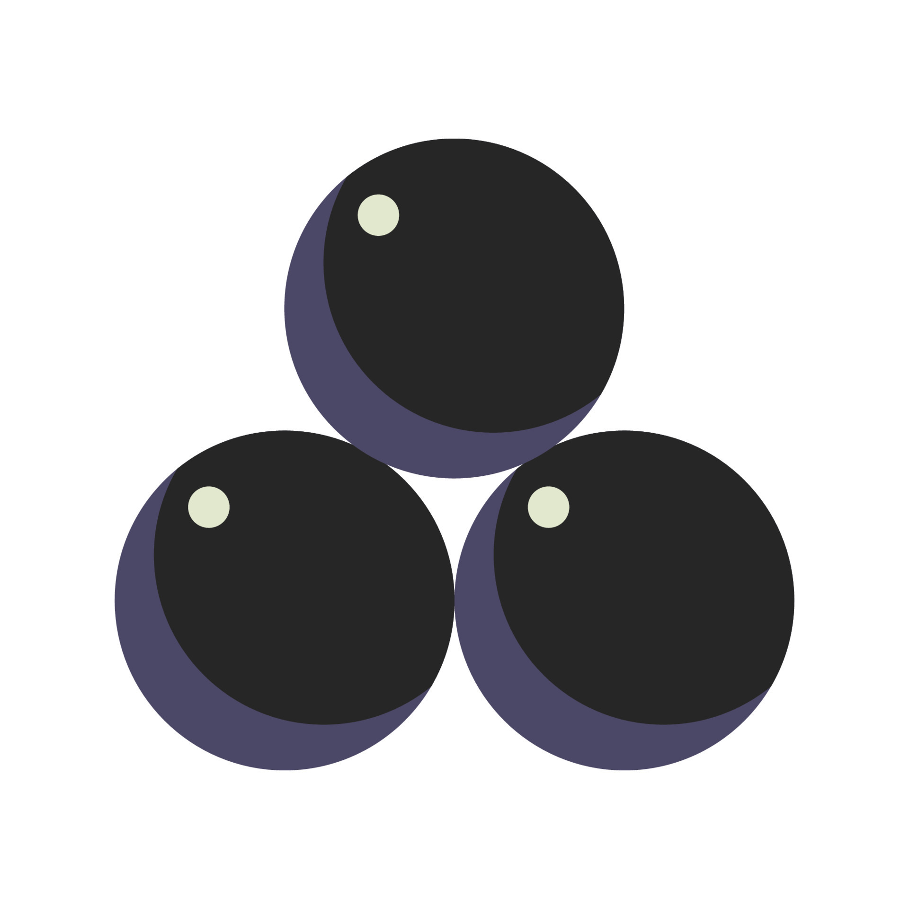
 
	Balas de referencia
 

A parte de las trampas a lo largo del nivel habrá diversos objetos con los que podremos interactuar o coleccionar:
	**-Botones:** Los cuales tendrán una luz roja cuando estén apagados y verde, encendidos

  
 
	Botón de Minecraft de referencia
 

 
**-Palancas:** Diseño simple con dos estados (derecha/izquierda o arriba/abajo)

  
 
	Palanca de Minecraft de referencia
 

 
**-Placas de presión:** Desnivel en el mapa para su notoriedad
**-Monedas:** Diseño simple de moneda ovalada con el logo en el centro

 

  
 
	 Moneda ovalada sin logo de referencia
 

**-Cajas:** Diseño de una caja que se podrá mover para ayudar a los jugadores a avanzar o resolver puzzles. 

 

  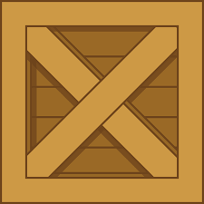
 
	Caja de referencia
 

# DISEÑOS FINALES

## TUK
Como teníamos previsto hemos usado una paleta de colores pasteles y un diseño más cartoon y familiar.
 

  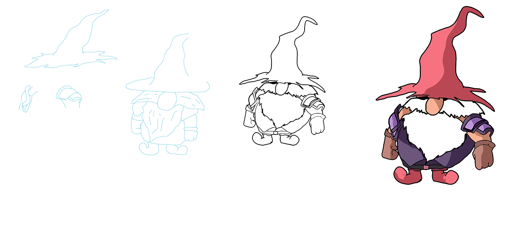
 
	 Evolución del diseño de Tuk
 

## LIAL
Por otra parte el diseño de Lial se ve algo más realista, pero se mantiene esa estética familiar y colores pasteles al igual que en su compañero.
 

  
 
	 Evolución del diseño de Lial
 

## BOTONES BASE 
Los botones han sido desarrollados vectorialmente para poder modificar su tamaño sin ningún problema para cada interfaz. A la izquierda aparece el botón que no está siendo pulsado y a la derecha el botón una vez se pone el cursor encima.

## FONDO PANTALLA INICIO
Pantalla de inicio con el nombre del juego a la izquierda y espacio a la derecha irán los botones de esta primera pantalla.

  
 
	Fondo de pantalla del incio
 

## TILES 
Esta paleta de tiles está cogida de Itch.io, y es de dominio público. Por ello, y para adaptarlo mejor a nuestro juego, la hemos retocado, de tal forma que tenga mayor apariencia de mazmorra.

  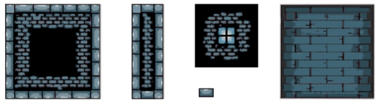
 
	Tiles modificados
 

## LOGOS					

Por el logo del juego, se ha optado por una torre de un castillo, puesto que es de ahí de donde deben escapar nuestros jugadores. Además, el nombre del juego lo encontramos en vertical, paralelo a la torre. 

Por otro lado, encontramos el logo del equipo, que basado en la misma dinámica vertical que el anterior, y jugando con el nombre (UpDown Games), se ha dividido en dos colores, uno por palabra, con unas flechas apuntando hacia la dirección de las propias palabras: Up, con su flecha hacia arriba y Down, con su flecha hacia abajo.

  
 
Logo del equipo
 

  
 
	Logo del juego
 

## OBJETOS
Los principales objetos interactuables que se implementaran en el juego y se han diseñado han sido las monedas del juego, las palancas para interactuar con el entorno y el temporizador.

  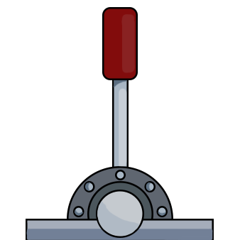
 
	Palanca
 

  
 
	Moneda
 

  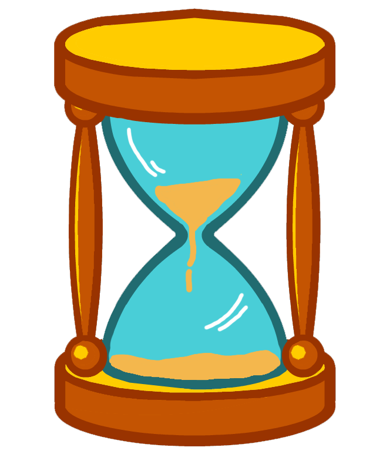
 
	Reloj
 

## ANIMACIONES
Para las animaciones de esta utilizando una técnica 2D de estilo tradicional.  Para la caminata de Tuk se han realizado 59 sprites para conseguir una animación fluida 

  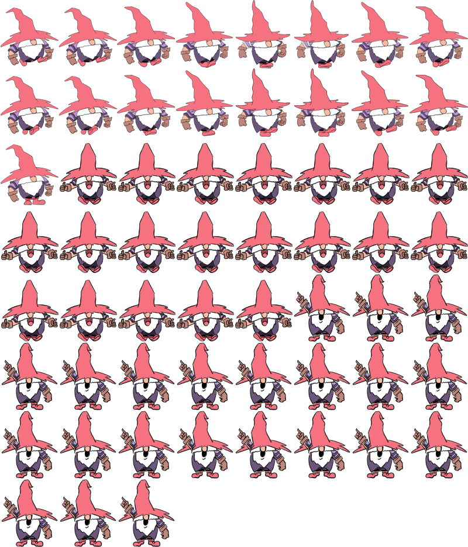

 
	Spritesheet de Tuk
 

Sin embargo,  en el caso de Lial, aunque el movimiento no es una caminata al uso, se han necesitado hasta 63 sprites, de forma que el movimiento sea más fluido. 

  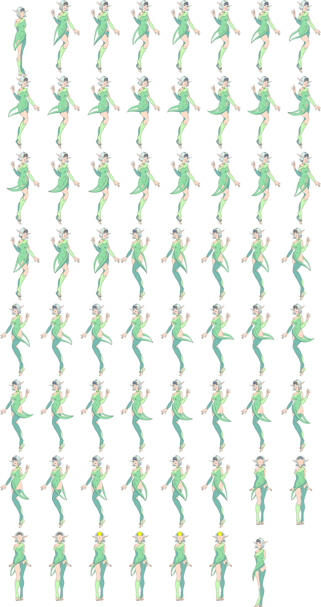
 
	Spritesheet de Lial
 

Además de esta ampliación de movimientos y animaciones, se han implementado en el juego, de forma que ambos personajes cuentan con diferentes poses de parado mirando a un lado y al otro, se desplazan a ambos lados con animaciones propias y tienen otros movimientos al saltar o al activar su poder personal.

También se ha incluido una animación de las monedas:

  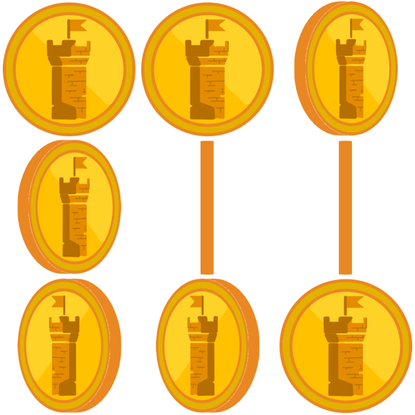
 
	Spritesheet de las monedas
 

Por último, se han generado sprites para la puerta de salida y las palancas, que se intentarán implementar en la última iteración como mejora.

  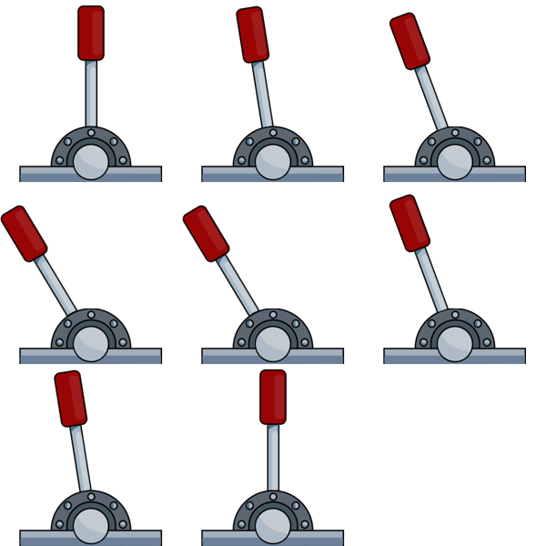
 
	Spritesheet de la palanca
 

  
 
	Spritesheet de la puerta de salida
 

# MÚSICA Y SONIDO

Respecto a la música, se contará con una de fondo frenética, con la intencionalidad de que nuestros jugadores se pongan nerviosos. Esta música aún no está definida, y se podrá ajustar el volúmen pero no quitarla, puesto que se considera algo necesario e importante en nuestro juego. 

Por otro lado, los sonidos y efectos de sonido que se incluirán son sonido de muerte, de caída, de salto y de andar. Además de otros como las plataformas en movimiento, barriles rodando, palancas y botones. 

Para la realización de la música base del juego se ha utilizado la aplicación LMMS y se ha generado una música que va aumentando su ritmo y la intensidad de los instrumentos. La canción ha sido creada de tal forma que se pueda establecer como un bucle y no se note demasiado el cambio.

Para la implementación del audio que suena al perder en el juego, ha sido obtenido de la siguiente url:  
<a href="https://youtu.be/34jXc49Aj3Q?si=bNVNygs1jKt1VhT-">Musica_Derrota</a>. 

Para la implementación del audio que suena al recoger monedas, ha sido sacado de la siguiente url: 
<a href="https://youtu.be/_LELiYg8WGI?si=1cS5-gahh-ybphrg">Sondio_Moneda</a>. 

Para la implementación del audio que suena al saltar en el juego, ha sido obtenido de la siguiente url:  
<a href="https://youtu.be/561qHylVC_o?si=GmXFr5ON4mI5qbqm">Sonido_Salto</a>. 

Para la implementación del audio empleado para la interacción con la palanca ha sido obtenido de la siguiente url:  
<a href="https://youtu.be/ZFFYSOLiS-M?si=bvGdT0rEE-pHXXOR">Sonido_Palanca</a>. 

Por último, para la implementación del audio para la obtención de dos insignias, se ha utilizado un audio de mariano rajoy : 
<a href="https://youtu.be/-nQgsEbU9C4?si=TpUrch66wgv_8zbH">Audio_Mariano</a>. 

y se ha empleado una ia para completar el audio para poder conseguir la segunda insignia de hacer la pelota:
<a href="https://fakeyou.com/tts/result/TR:63nzkvqej6g791220kcxmr59v1mtw">FakeYou</a>. 

# TIEMPO, INTERFAZ Y CÁMARA
## TIEMPO
Como se ha mencionado anteriormente, una de las condiciones de victoria es superar el nivel antes del tiempo establecido. Anteriormente pensamos en el desarrollo de una barra de tiempo que nos muestre una idea de cuánto tiempo nos quedaba, sin embargo cambiamos la idea por una más precisa  e informativa y no tan visual. Dicho tiempo se mostrará en pantalla en un temporizador que aparecerá en la esquina superior derecha. Aún se está considerando cuánto tiempo límite  poner por nivel, de momento está establecido en un tiempo máximo de tres minutos. Se está barajando la idea de poner temporizadores a lo largo del nivel para incrementar dicho tiempo.

 

  
 
	 Referencia tiempo nivel
 

 

  
 
	 Diseño inicial del temporizador
 

## INTERFAZ
Para el apartado de la interfaz tendremos una pantalla de inicio donde podremos tanto elegir en qué modo de juego queremos jugar, configurar el sonido y ver los créditos. Una vez iniciado el nivel, la interfaz de pausa contará con un menú de opciones, reiniciar, volver al menú de inicio o salir del juego.
In-game, nos encontraremos con un contador de las monedas que vayamos recolectando y el temporizador explicado previamente.

 

  
 
	 Interfaz pantalla inicial
 

 

  
 
	 Interfaz selección de personaje
 

 

  
 
	 Interfaz selección de nivel
 

 

  
 
	 Interfaz pantalla de juego
 

 

  
 
	 Interfaz pantalla de pausa
 

Por otra parte, se han realizado unos diseños generales para mejorar la calidad y diseño de las interfaces de navegación del juego. En la entrega tres la parte de diseño se ha basado principalmente en la mejora de algunos sprites del propio nivel y juego en sí, pero sobre todo se ha basado en el diseño y creación de objetos que se han añadido a las pantallas de navegación y pantallas base del juego. Los objetos creados son:

### 1- BOTÓN VOLVER
Se ha creado un botón con forma de flecha para implementar en las interfaces en las que se ofrezca la posibilidad de volver atrás. La evolución ha sido la siguiente:

 

  
 
	 Botón flecha volver
 

### 2- BOTONES MÚSICA
Otra implementación nueva tanto en términos de programación como de diseño desarrollados en esta entrega, es dar funcionalidad al apartado de ajustes, ofreciendo la posibilidad de desactivar o reactivar la música del juego. Para ello, se ha creado un botón que cambia entre dos estados dependiendo del estado de la música:

 

  
	 
 
	 Botón activar y desactivar música
 

### 3- INTERFAZ IDENTIFICADOR DE PANTALLA
Otro aspecto que queríamos mejorar de nuestro juego, era dar consciencia al usuario en qué pantalla se encuentra en todo momento, para ello se ha diseñado un pequeño identificador acorde con la estética del juego para incluir en todas las posibles pantallas del flujograma de navegación:

 

  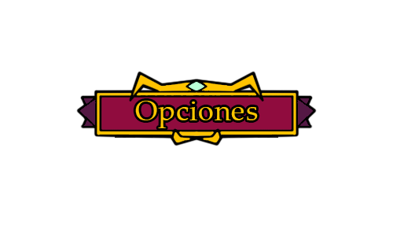
 
	 Identificador de apartado opciones
 

### 4- INTERFAZ PARA EL APARTADO DE LOGIN
Por último, se ha desarrollado el diseño de un recuadro para implementar en el apartado del LogIn, ya que con las posibilidades que ofrecía el HTML no quedaba acorde con nuestra temática del juego, por ello, se han desarrollado varios recuadros para poder iniciar sesión en ellos:

 

  
 
	 Cuadro de iniciar sesión
 

### 5- MEJORAS DE TEXTO
Por último comentar que fuera de la parte de diseño y creación de interfaces, se han creado distintos textos con una fuente mejor adaptada al juego para implementar tanto en el tutorial cómo en las pantallas de navegación:

 

  
 
	 Texto para informar del registro de un usuario
 

## CÁMARA
Por último mencionar que ambos personajes se encontrarán en todo momento en la cámara del juego, y una mecánica de la cámara importante a destacar es que cuando uno de los dos jugadores avance más, dejando al otro atrás (fuera de cámara), ambos morirán y tendrán que empezar de nuevo. De esta forma ambos serán conscientes de lo que hace su compañero en todo momento y se fomentará el trabajo en equipo y colaboración de los usuarios.

## ESCENARIOS

Los escenarios serán habitaciones dentro del castillo. Según los jugadores vayan subiendo, aumentará el nivel de dificultad: mayor cantidad de trampas y mayor complejidad de los puzzles. 

Los escenarios serán, al igual que los personajes, de colores pastel y planos.

Algunos de los escenarios que encontraremos, de abajo hacia arriba serán las mazmorras, puerta de entrada principal del castillo, el salón, habitaciones y, finalmente, la parte de las almenas del castillo, donde tienen que llegar nuestros personajes para escapar. 

 

  
 
	Referencia mapa vertical (videojuego Rising hell)
 

 

  
 
	Referencia mapa vertical (Juego Donkey Kong)
 

## IMPLEMENTACIÓN DEL MAPA
Para poder hacer los mapas se ha decidido usar la herramienta Tiled, un software que permite de forma visual usar un tileset para diseñar un nivel de forma rápida dando propiedades como por ejemplo colisiones a las tiles desde el propio programa, para luego cargar estos mapas como formato json directamente en phaser.
Se ha usado un tileset gratuito de 
<a href="https://pixelfrog-assets.itch.io/kings-and-pigs">Itch.io</a>. 

Gracias a esto la pipeline de trabajo se acorta bastante y nos permite desarrollar varios niveles en menos tiempo.

La pipeline de trabajo ha sido:
Diseño del nivel “A papel” > Implementación del diseño en Tiled > Cargar mapa en el juego

 

  
 
	 Diseño del mapa
 

 

  
 
	 Implementacion en tiled
 

 

  
 
	 Resultado final
 

# DIAGRAMA DE FLUJO
Desde el menú de inicio, el jugador podrá ver los créditos, meterse en opciones, donde podrá subir o bajar el volumen general, el de los efectos de sonido y la música,  o salir del propio juego. Evidentemente, también podrá jugar, lo que le llevará a elegir entre local u online.
Independientemente de si está jugando en local o en online, podrá entrar en un menú de pausa. Aquí podrá reiniciar el nivel, entrar en opciones (un menú idéntico al que ya hemos mencionado), salir y volver al menú principal, que le llevará a la pantalla de inicio del juego. 

 

  
 
	 Diagrama de flujo
 

# DIAGRAMA DE NAVEGACIÓN
Se empieza el juego en la pantalla principal, en la que tenemos las posibilidades de acceder a jugar, opciones y créditos. Si accedemos a opciones en un futuro habrá un sistema de gestión de opciones de sonido. Si accedemos a créditos aparecerán unos créditos de los creadores del juego, nosotros, y una breve explicación del tipo de juego que es. Por último si accedemos a jugar, pasaremos a la pantalla de selección de personajes en la que aparecen los dos personajes jugables y un acceso al apartado de niveles, en el cual si accedemos a él nos saldrán los diversos niveles que posee el juego y al clicar en el nivel deseado accedemos a la pantalla de juego de dicho nivel. Además desde la pantalla de juego, pulsando la tecla escape se accedera a la pantalla de pausa con las posibilidades de volver al menú, abrir el apartado de opciones, reiniciar el nivel o volver al apartado de niveles en caso de querer jugar un nivel diferente. 
Por último comentar que las pantallas de opciones, créditos, selección de personajes y niveles tienen la opción de volver a la pantalla anterior clicando en la flecha situada en la esquina superior izquierda.

 

  
 
	 Diagrama de navegacion
 

# Diagrama de clases
Para esta nueva iteraación se han generado 6 clases nuevas, 2 para el chat, 2 para usuarios y otras 2 para los records, sin independencias entre los pares. No obstante, cada uno se compone de una classe para cada objeto enviado y una clase @Controller para recibir y procesar los mensajes recibidos para cada parte.

 

  
 
	 Diagrama de clases
 

# INSTRUCCIONES DE EJECUCIÓN
Primero, se deberá levantar el servidor desde Spring Boot. Puesto que la implementación de la API detecta desde qué red lo estás lanzando, lo único que tendremos que hacer es cerciorarnos a qué red estamos conectados. Eso se sabrá con ipconfig en la CMD. Posteriormente, deberemos pegar esa ip seguido de nuestro puerto, :8080 por defecto. 

Ya se podrá disfrutar de Topwer.

# CHAT
Como funcionalidad nueva, se ha incluido un chat para poder comunicarse durante la partida. Ambos jugadores pueden escribir comentarios en una ventana fija en la parte inferior derecha y se actualizará en ambos equipos a la vez. Para ello se ha establecido una API REST que envía el mensaje junto al nombre del jugador (por el momento solo "Player") a memoria y se actualiza en ambos periódicamente cada 2 segundos. Al ser un chat de partida, no se ve el sentido de generar persistencia, puesto que al cerrar el servidor y levantarlo de nuevo, se presupone una partida nueva y por tanto una nueva conversación. No obstante, si durante la partida se conectase un nuevo jugador, automáticamente verá descargada toda la conversación hasta ese momento.
 

  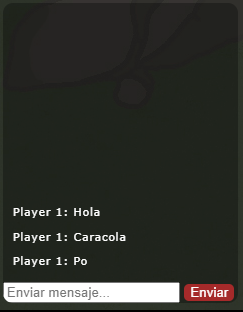
 
	 Ventana del chat durante la partida
 

# PANTALLA DE LOGIN
Como nueva funcionalidad y forma de implementar la API Rest en nuestro juego, se ha desarrollado una pantalla de login en la cual se podrá registrar un usuario en caso de que no se posea cuenta o se quiera crear una nueva (utilizando métodos post), en caso de ya tener un usuario creado, mediante el uso de métodos get, se ha creado la opción de iniciar sesión, destacar que la información de los usuarios persiste y se mantiene aun cerrando el servidor. Por otra parte se ha implementado un apartado para actualizar la contraseña en caso de que se te haya olvidado (utilizando métodos put). Por último se ha implementado la opción de eliminar usuario, para en caso de querer eliminar alguna cuenta que ya no se vaya a utilizar, sea posible (para ello se han utilizado métodos delete).

 

  
 
	 Pantalla login completa
 

